# Summary

This application will showcase how to interact with data from both a Serverless Database and Blockchain in an Ecommerce Store. Product information such as the product description, name, and price will be stored in a Serverless Cassandra Database. Payment related transactions are executed on the blockchain. AstraDB is used as the database and Rinkeby Testnet is used for the blockchain. In addition, the actual product images are stored in a AWS S3 bucket.

## Components

- DataStax Astra DB (stores operational data)
- Metamask Wallet
- AWS S3 (stores product images)

# CryptoCommerce
*30 min, Medium, [Start Building](#Start-Building)*

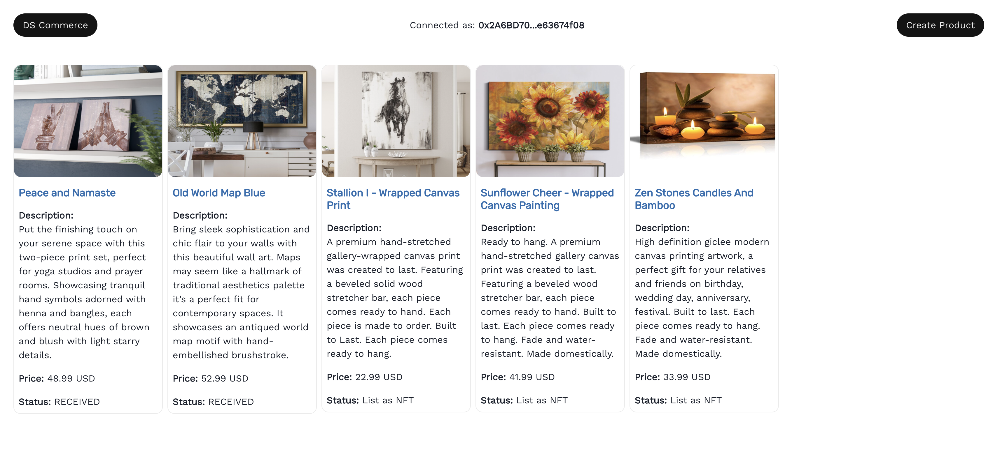

This application demo will walk through a series of transactions between a buyer and seller. The transactions demonstrated will be:
* Seller listing the product (listing fee: 0.025ETH)
* Buyer placing a bid on the product (product price: 0.1ETH + listing fee: 0.025ETH)
* Seller will ship the product (returned the listing fee: 0.025ETH)
* Buyer will confirm receipt of the product (returned the listing fee: 0.025ETH | seller receives product price: 0.1ETH)

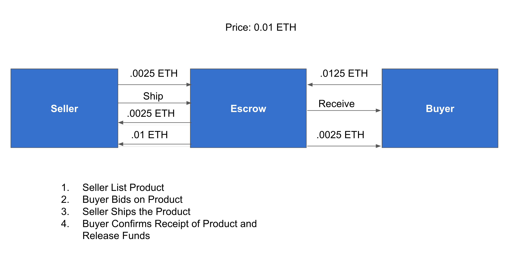

## Objectives
* Set up a Metamask Wallet
* Deploy a serverless database, create tables, and insert data
* Application walk through

## Prerequisites
Let's do some initial setup:
1. Creating a Serverless Database with AstraDB
2. Set up your Amazon S3 Bucket
3. Download and install the [Metamask](https://metamask.io/) browser extension
4. Connect your wallet to the Rinkeby Testnet
5. Create multiple accounts within Metamask
6. Fund the wallet with Test Tokens using the [Rinkeby Faucet](https://rinkebyfaucet.com/)

## Start Building

### DataStax Astra
<!--- enter a unique UTM_CODE for your sample app below --->
1. Create a [DataStax Astra account](https://astra.datastax.com/register?utm_source=github&utm_medium=referral&utm_campaign=UTM_CODE) if you don't already have one:
   

2. On the home page. Locate the button **`Create Database`**
   

3. Locate the **`Get Started`** button to continue
   

4. Define a **database name: `Cryptocommerce`**, **keyspace name: `ecommerce`** and select a database **region**, then click **create database**.
   

5. Your Astra DB will be ready when the status will change from *`Pending`* to **`Active`** 💥💥💥
   

6. After your database is provisioned, we need to generate an Application Token for our App. Go to the `Settings` tab in the database home screen.
   

7. Select `Admin User` for the role for this Sample App and then generate the token. Download the CSV so that we can use the credentials we need later.
   

8. After you have your Application Token, head to the database connect screen and copy the connection information. Add your `ASTRA DATABASE ID`, `ASTRA DATABASE REGION`, `KEYSPACE NAME`, AND `TOKEN VALUE` to the .env.example file. Save that file as a `.env` file.
   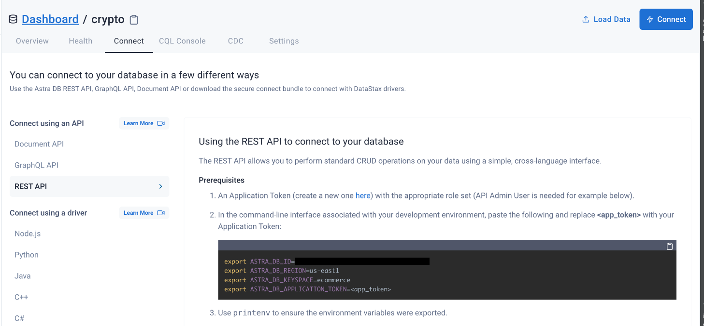
```angular2html
NEXT_PUBLIC_BLOCKCHAIN_NETWORK=Rinkeby
NEXT_PUBLIC_ASTRA_DB_URL=https://${NEXT_PUBLIC_ASTRA_DB_ID}-${NEXT_PUBLIC_ASTRA_DB_REGION}.apps.astra.datastax.com/api/rest/v2/keyspaces/${NEXT_PUBLIC_ASTRA_DB_KEYSPACE}
NEXT_PUBLIC_ASTRA_DB_ID=<<YOUR_ASTRA_DB_ID>>
NEXT_PUBLIC_ASTRA_DB_REGION=<<YOUR_ASTRA_REGION>>
NEXT_PUBLIC_ASTRA_DB_KEYSPACE=<<YOUR_KEYSPACE_NAME>>
NEXT_PUBLIC_ASTRA_DB_APPLICATION_TOKEN=<<YOUR_TOKEN_VALUE>>
```

#### Create Tables and Insert Data with CQL console
1. Navigate to the CQL Console in AstraDB, execute the create table statements.
```
CREATE TABLE ECOMMERCE.CATALOG(
    product_id uuid,
    description text,
    product_status text,
    price decimal,
    name text,
    seller_address text,
    tokenId text,
    buyer_address text,
    PRIMARY KEY (product_id)
);

CREATE TABLE ECOMMERCE.ACTIVITY_STREAM(
    wallet_address text,
    product_id text,
    action text,
    timestamp text,
    PRIMARY KEY (wallet_address, timestamp)
);
```
2. Insert Product Data into the Catalog Table
```angular2html
insert into ecommerce.catalog(product_id,description,product_status,price,name,seller_address,tokenId,buyer_address)
values (ccf8bde3-3940-476d-a40d-6a0cf4161e67,'Put the finishing touch on your serene space with this two-piece print set, perfect for yoga studios and prayer rooms. Showcasing tranquil hand symbols adorned with henna and bangles, each offers neutral hues of brown and blush with light starry details.','RECEIVED', 48.99 ,'Peace and Namaste','0xc9E886f5CaF24A077765d826f2370D480E21A5b1','21','0x66A22Bb26500eD1BCcd9068d38e800AaC1098f47');

insert into ecommerce.catalog(product_id,description,product_status,price,name,seller_address,tokenId,buyer_address)
values (9b37b091-a112-4589-acec-171e1b54b738,'Bring sleek sophistication and chic flair to your walls with this beautiful wall art. Maps may seem like a hallmark of traditional aesthetics palette it’s a perfect fit for contemporary spaces. It showcases an antiqued world map motif with hand-embellished brushstroke.','RECEIVED', 52.99,'Old World Map Blue','0xc9E886f5CaF24A077765d826f2370D480E21A5b1','22','0x66A22Bb26500eD1BCcd9068d38e800AaC1098f47');

insert into ecommerce.catalog(product_id,description,product_status,price,name,seller_address,tokenId,buyer_address)
values (33791cb1-5276-447d-9104-c8813cf23730,'A premium hand-stretched gallery-wrapped canvas print was created to last. Featuring a beveled solid wood stretcher bar, each piece comes ready to hand. Each piece is made to order. Built to Last. Each piece comes ready to hang.','DRAFT', 22.99,'Stallion I - Wrapped Canvas Print','0xc9E886f5CaF24A077765d826f2370D480E21A5b1','23','0x66A22Bb26500eD1BCcd9068d38e800AaC1098f47');

insert into ecommerce.catalog(product_id,description,product_status,price,name,seller_address,tokenId,buyer_address)
values (d59bb923-3d74-498d-938f-dca1dabb172a,'Ready to hang. A premium hand-stretched gallery canvas print was created to last. Featuring a beveled wood stretcher bar, each piece comes ready to hand. Built to last. Each piece comes ready to hang. Fade and water-resistant. Made domestically.','DRAFT', 41.99,'Sunflower Cheer - Wrapped Canvas Painting','0xc9E886f5CaF24A077765d826f2370D480E21A5b1','24','0x66A22Bb26500eD1BCcd9068d38e800AaC1098f47');

insert into ecommerce.catalog(product_id,description,product_status,price,name,seller_address,tokenId,buyer_address)
values (38873edd-3ce3-4be8-a324-2c1d943e4565,'High definition giclee modern canvas printing artwork, a perfect gift for your relatives and friends on birthday, wedding day, anniversary, festival. Built to last. Each piece comes ready to hang. Fade and water-resistant. Made domestically.','DRAFT', 33.99,'Zen Stones Candles And Bamboo','0xc9E886f5CaF24A077765d826f2370D480E21A5b1','25','0x66A22Bb26500eD1BCcd9068d38e800AaC1098f47');

insert into ecommerce.catalog(product_id,description,product_status,price,name,seller_address,tokenId,buyer_address)
values (19dea9af-ceb0-4e00-82b0-5a35acb70148,'The Solid Wood Mounted Canvas Prints are stylish, attractive and suitable for any contemporary, modern, vintage or retro decor indoor wall art','DRAFT', 27.99,'Aurora Scenery Painting','0xDee37c9A368924AE591AF4FcDE74332C3c29bc9f','43','0x2A6BD70F5c95311bBDcCafde848eE60e63674f08');
```
3. View your tables. The catalog table will now have all the product data. The activity_stream table will be empty.
```angular2html
select * from ecommerce.catalog;

select * from ecommerce.activity_stream;
```

### AWS S3 Bucket

1. Navigate to the AWS Console, create an account if necessary. 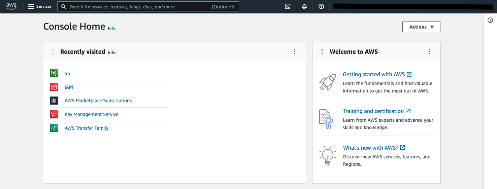
2. Navigate to AWS S3 and click on `Create Bucket`. 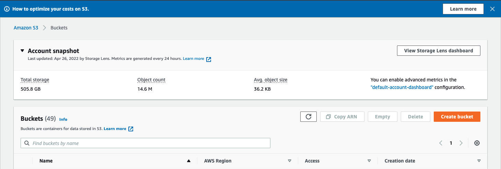
3. Name your bucket 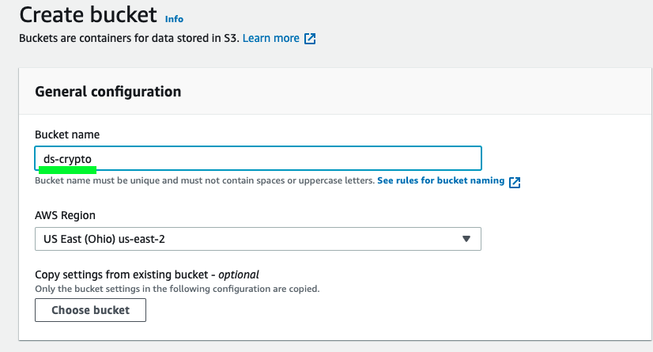
4. Allow all public access to the bucket by de-selecting here 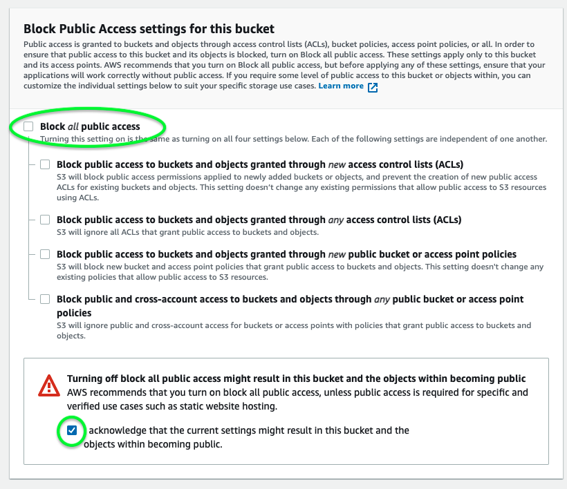
5. Click on `Create Bucket`
6. Navigate to permissions and add this bucket policy. Insert `Your Bucket Name` into the policy.

```
{
   "Version": "2012-10-17",
   "Statement": [
      {
      "Principal": "*",
      "Effect": "Allow",
      "Action": [
      "s3:GetObject",
      "s3:GetObjectVersion"
      ],
      "Resource": "arn:aws:s3:::<<YOUR-BUCKET-NAME>>/*"
      }
   ]
}
```
7. In Permissions, update your `Cross-origin resource sharing (CORS)`

```angular2html
[
   {
      "AllowedHeaders": [
            "*"
      ],
      "AllowedMethods": [
            "GET",
            "PUT"
      ],
      "AllowedOrigins": [
            "*"
      ],
      "ExposeHeaders": []
   }
]
```
8. Upload the product images (images/product_images) to your bucket
9. Create an [Access Key](https://www.youtube.com/watch?v=vucdm8BWFu0) with full S3 permissions. Add the `ACCESS KEY ID`,`SECRET ACCESS KEY`, `BUCKET NAME`, and `AWS REGION` to the .env file.
```angular2html
NEXT_PUBLIC_AWS_S3=https://${NEXT_PUBLIC_S3_BUCKET}.s3.amazonaws.com/
NEXT_PUBLIC_ACCESSKEYID=<<YOUR_ACCESS_KEY_ID>>
NEXT_PUBLIC_SECRETACESSKEY=<<YOUR_SECRET_ACCESS_KEY>>
NEXT_PUBLIC_S3_BUCKET=<<YOUR_BUCKET_NAME>>
NEXT_PUBLIC_REGION=<<YOUR_REGION>>
```

### Metamask

1. Download the browser extension and follow the setup steps 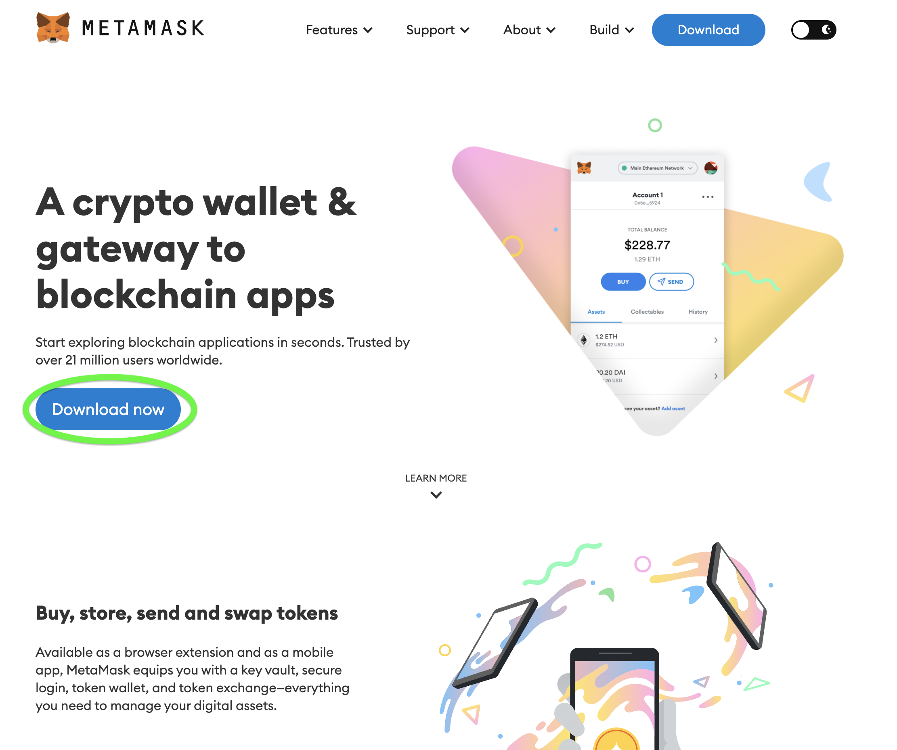
2. Navigate to the Metamask wallet, and click the dropdown under **Ethereum Mainnet**. Click on **Show/hide test networks** 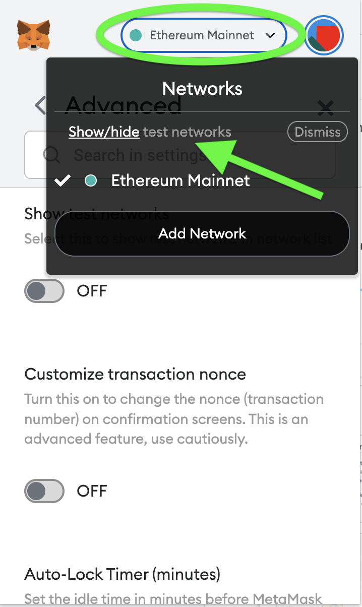
3. Turn **ON** the show/hide networks 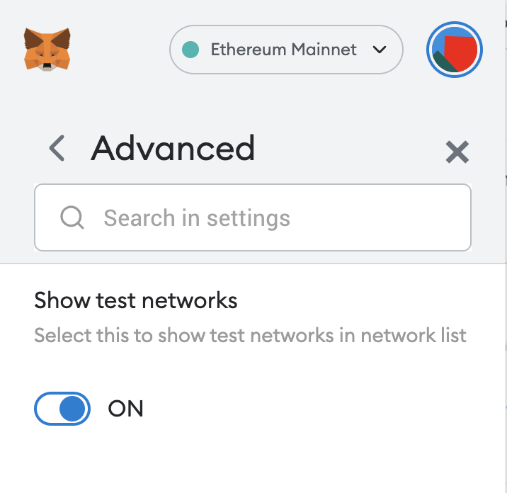
4. Select the **Rinkeby Test Network**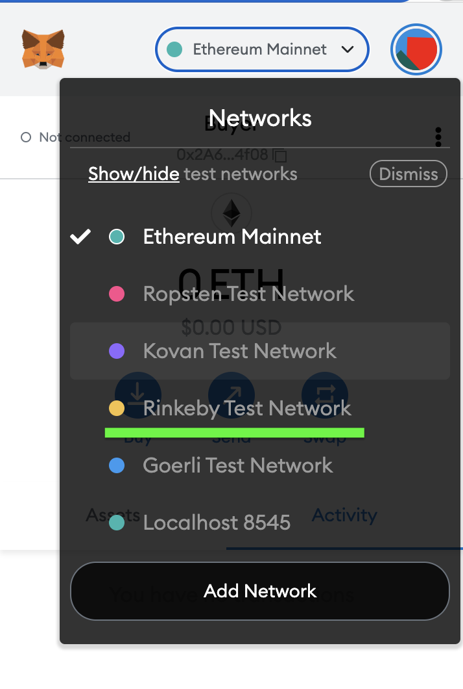
5. Click the dropdown on the top right. Select **+ Create Account**. Create a **Buyer Account** AND a **Seller Account** 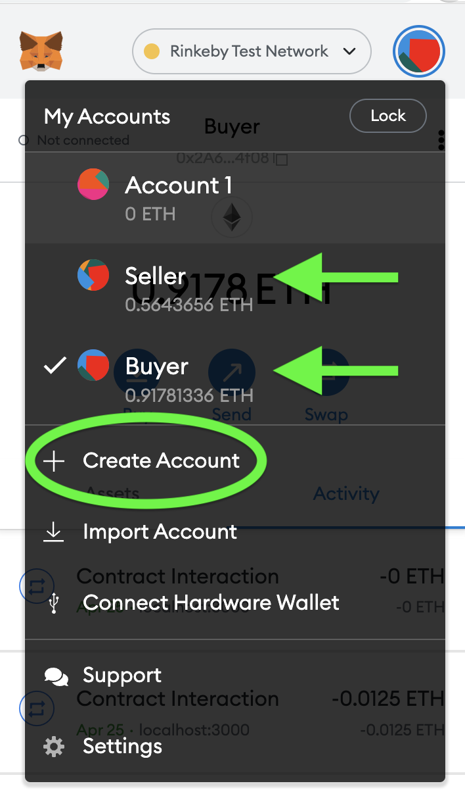


### Fund your wallets

1. Copy your buyer wallet address from Metamask 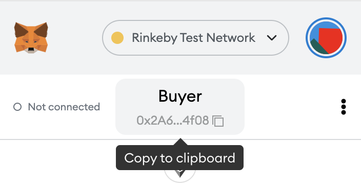
2. Create/Log in to an Alchemy Account to the [Rinkeby Faucet](https://rinkebyfaucet.com/). Paste your wallet address and click **Send Me ETH** to get 0.5 Test ETH.  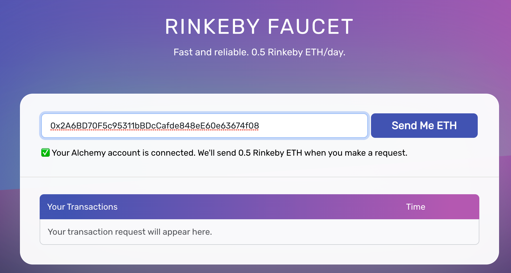
3. Send half of the test funds (**0.25 ETH**) from Buyer to Seller account 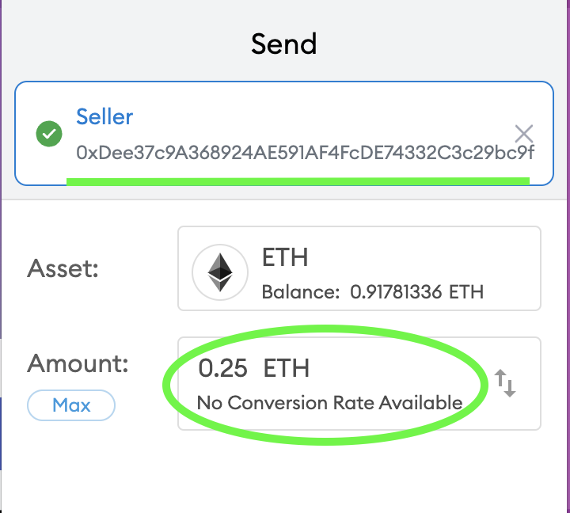

### Github
<!-- Enter your GITHUB_URL below -->
1. Click `Use this template` at the top of the [GitHub Repository](https://github.com/DataStax-Examples/dscryptocommerce-astradb):
   

2. Enter a repository name and click 'Create repository from template':
   

3. Clone the repository:
   


## 🚀 Getting Started Paths:
*Make sure you've completed the [prerequisites](#prerequisites) before starting this step*
- [Running on your local machine](#running-on-your-local-machine)

### Running on your local machine

#### Installation
```shell
yarn install
```

#### Execution
```shell
yarn dev
```

### Demo the Application

1. Click on the `Connect to Metamask` button within the store. Select the `Buyer and Seller` accounts in Metamask. View the products in the store 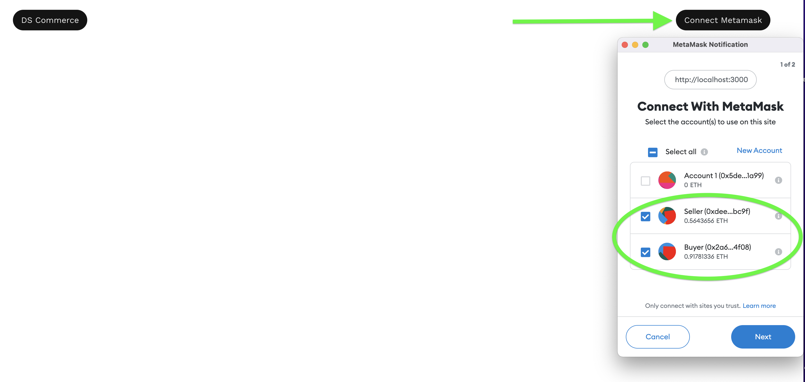
2. Create a sample product and upload an image
```angular2html
Title: Aurora Scenery Painting
Price: 27.99
Description: The Solid Wood Mounted Canvas Prints are stylish, attractive and suitable for any contemporary, modern, vintage or retro decor indoor wall art.
```
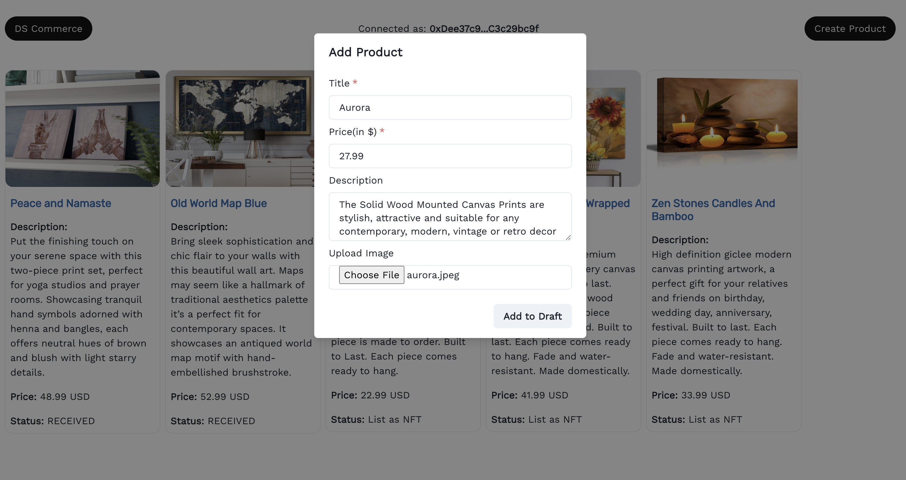
3. Navigate to the **Seller Wallet**, `List the NFT`. Wait for the transaction to confirm in Metamask. 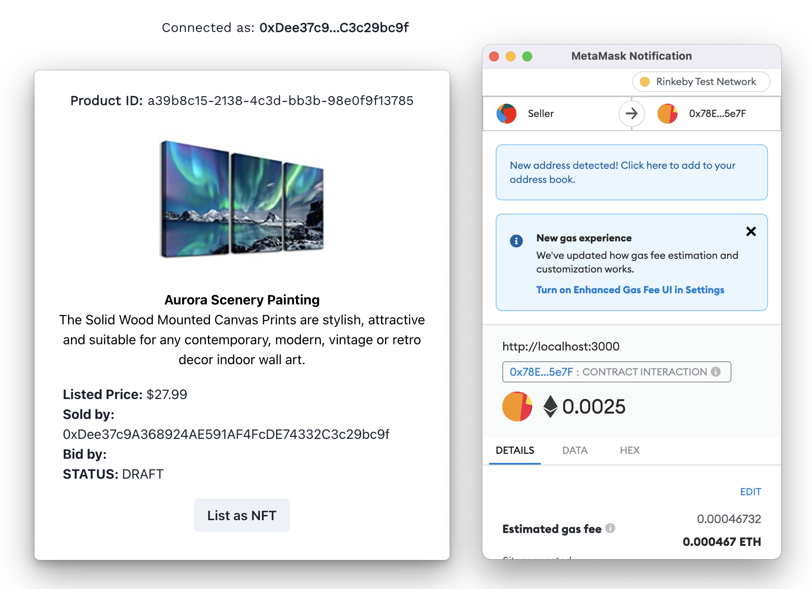
4. Navigate to the **Buyer Wallet**, `Place bid on the NFT`. Wait for the transaction to confirm in Metamask. 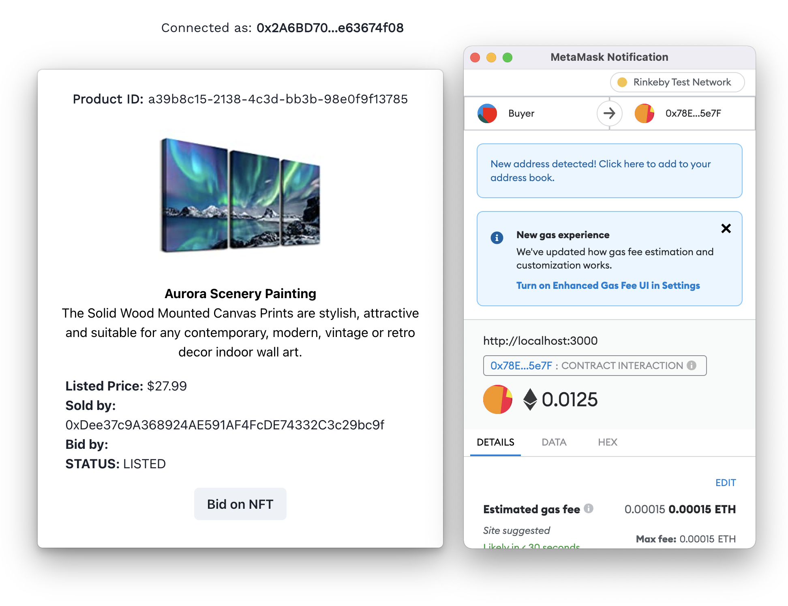
5. Navigate to the **Seller Wallet**, `Ship the NFT`. Wait for the transaction to confirm in Metamask. 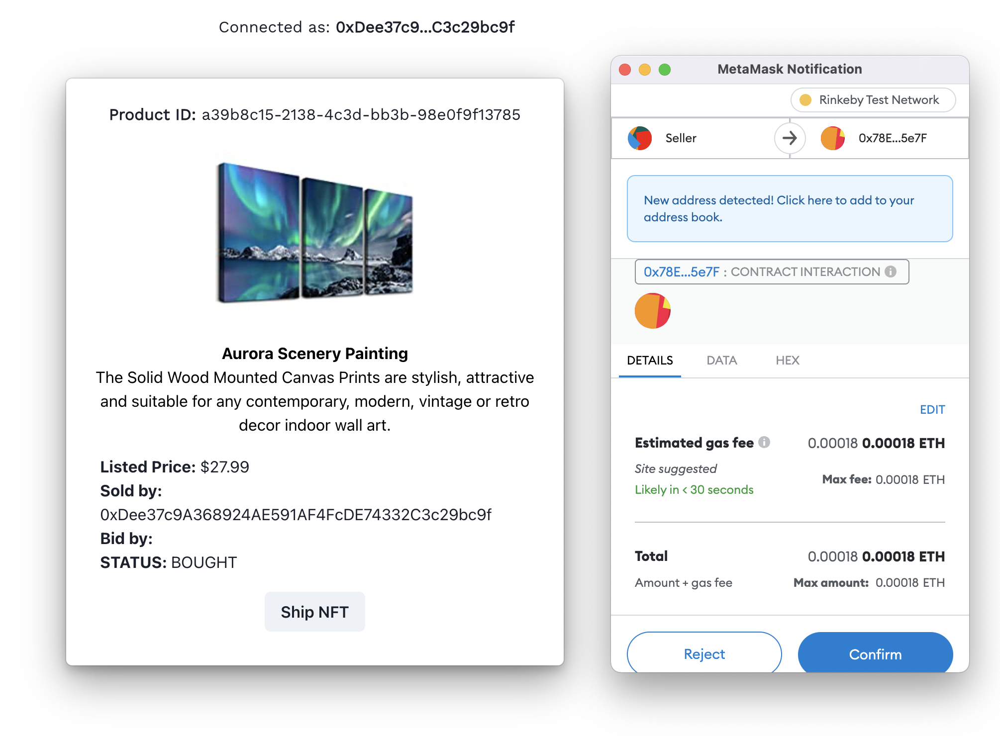
6. Navigate to the **Buyer Wallet**, `Receive the NFT`. Wait for the transaction to confirm in Metamask. 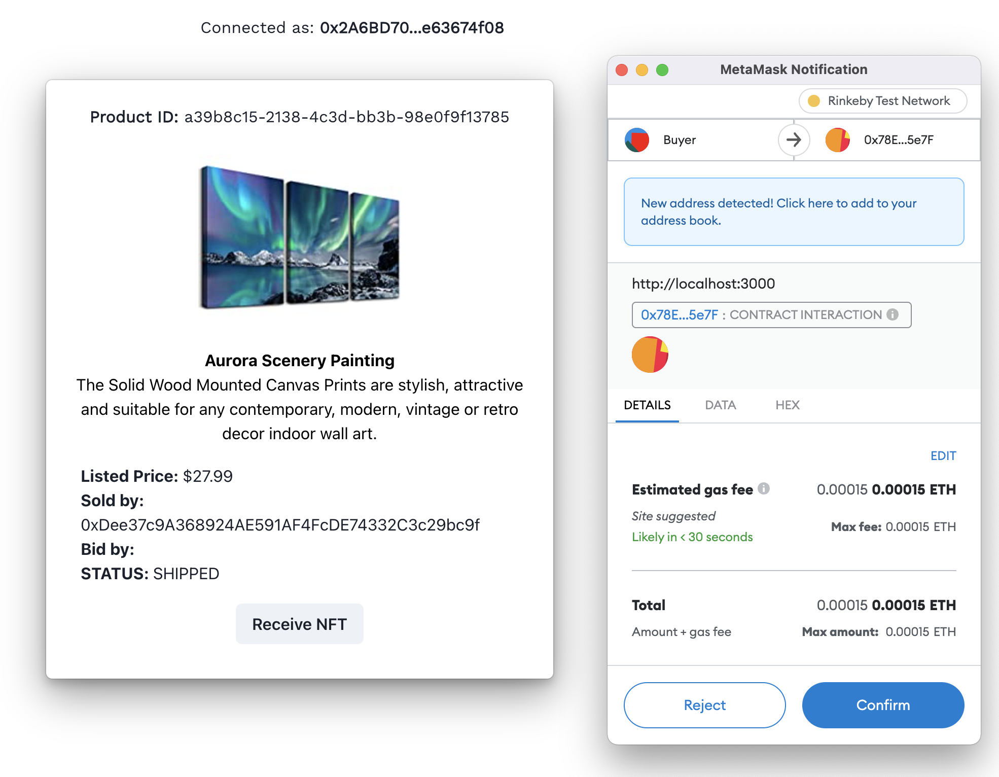
7. The product is successful and the deal is closed! 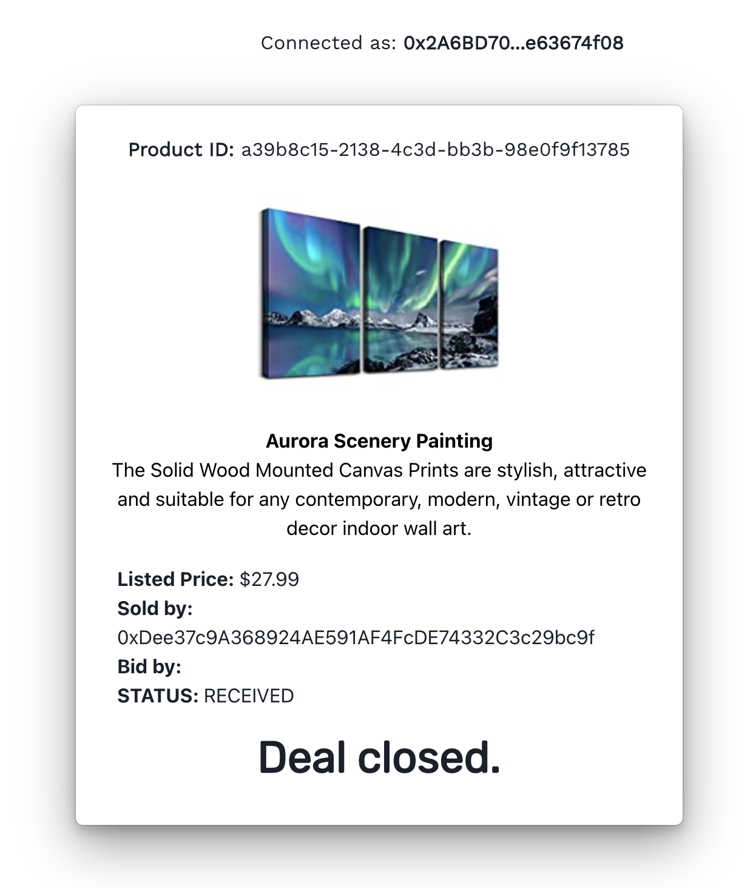
8. View the click stream data in the `activity stream table`. Each activity in the application was tracked to the activity_stream table by a POST Request to AstraDB.
```angular2html
SELECT * FROM ecommerce.activity_stream;
```
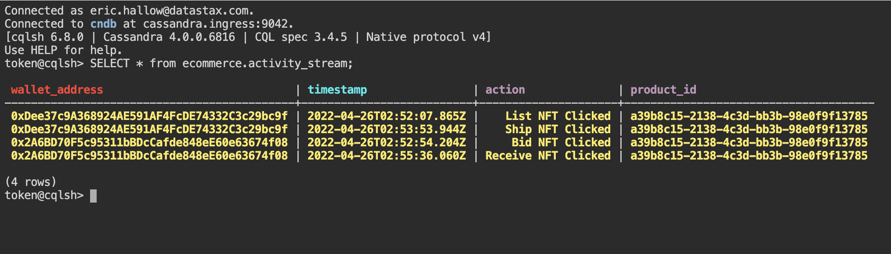
9. You can view the transactions on the block explorer


